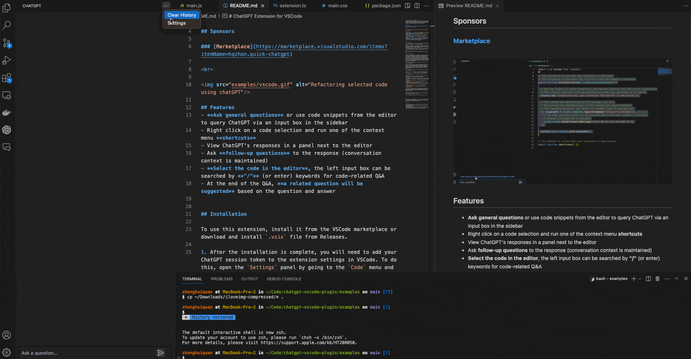
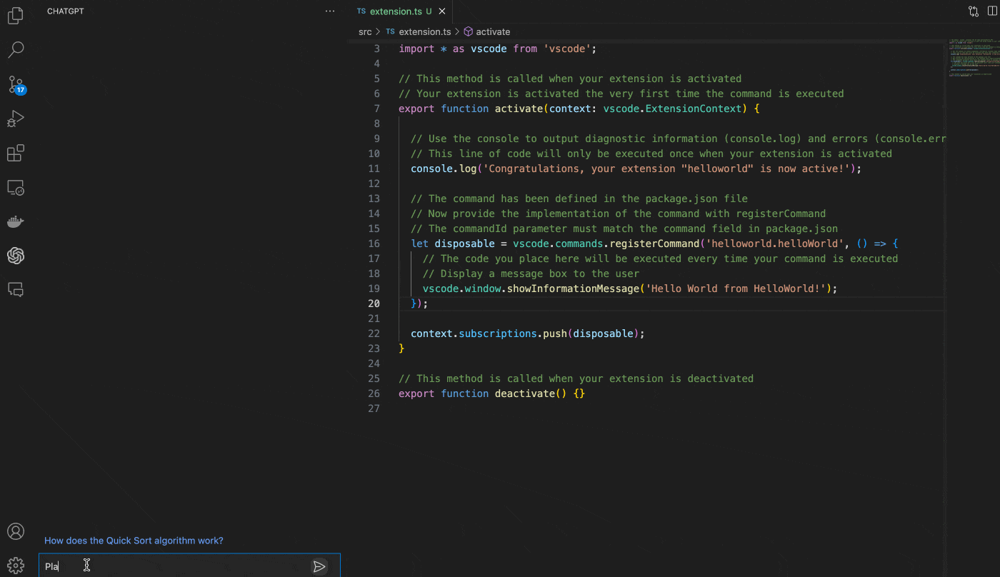
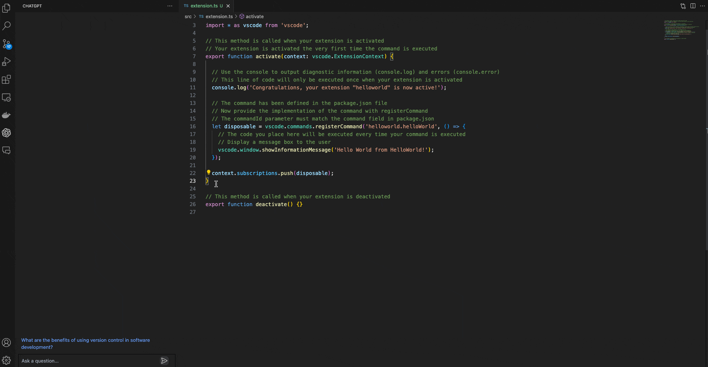
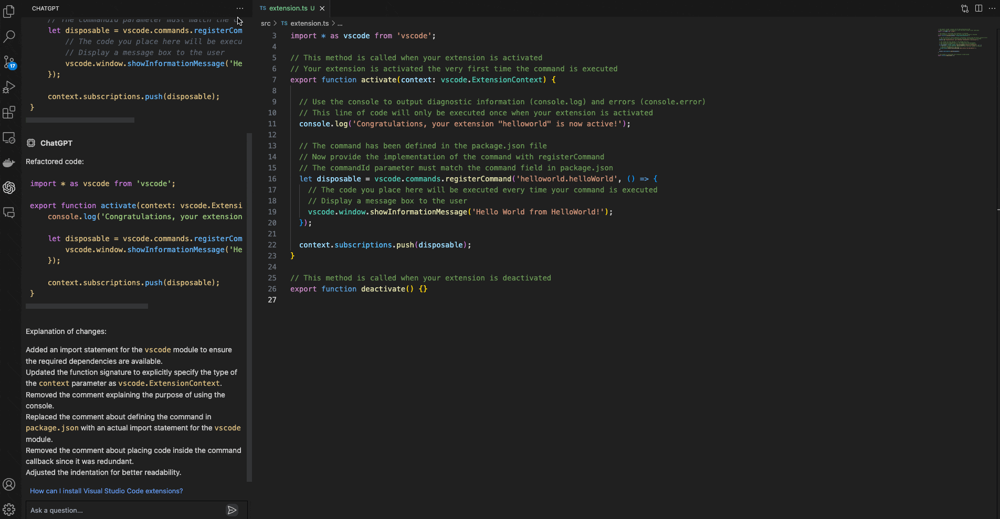

# ChatGPT VSCode插件 
此 Visual Studio Code 插件允许您使用 [ChatGPT API](https://github.com/hqzhon/chatgpt-api) 在编辑器中直接生成 OpenAI 的 [ChatGPT](https://chat.openai.com/chat) 消息对您的问题的进行自然语言回复。

## 功能预览

### [市场下载](https://marketplace.visualstudio.com/items?itemName=hqzhon.quick-chatgpt)

 

## 功能
- **提出一般问题**，或使用编辑器中的代码片段，通过侧边栏的输入框查看 ChatGPT 对话消息
- 右键点击代码选中代码，运行上下文菜单中的**快捷方式**
- 在编辑器旁边的面板中查看 ChatGPT 的回复
- 对回复提出**后续问题**（对话上下文保持不变）
- 在编辑器中选择代码，左侧输入框可通过 **"/"（或输入）关键词**搜索代码相关问答
- 问答结束时，**会根据问答内容推荐**相关问题

## 安装
要使用此扩展，请从 VSCode 市场安装，或从 Releases 下载并安装 `.vsix` 文件。安装完成后，您需要将 ChatGPT apiKey 添加到 VSCode 的扩展设置中。可根据以下方法设置:

或者通过以下步骤设置:
1. 安装完成后，您需要将 ChatGPT apiKey 添加到 VSCode 的扩展设置中。为此，请进入 "代码 "菜单并选择 "首选项"，然后选择 "设置"，打开 "设置 "面板。
2. 在搜索栏中输入 `ChatGPT` 以筛选设置列表。
3. 在 "ChatGPT "部分，在 "apiKey "字段中输入您的 apiKey。

完成这些步骤后，扩展就可以使用了。

## 使用扩展

要使用扩展，请在 Visual Studio Code 中打开文本编辑器，然后点击侧边栏中的 ChatGPT 图标，打开 ChatGPT 面板。这将打开一个带有输入框的面板，您可以在其中输入您的提示或问题。点击回车键后，问题将被发送到 ChatGPT。生成结束后，系统会推荐一个相关问题，您可以点击该问题直接提问。

您还可以在编辑器中选择代码片段，然后在侧边面板中输入提示，或右键单击并选择 "询问 ChatGPT"。所选代码将在发送到人工智能时自动附加到您的查询中。这对于生成代码片段或获取特定代码的解释非常有用。

**在编辑器中选择代码。

**在编辑器中选择代码**，左侧输入框可通过**"/"**（或输入）关键词搜索与代码相关的问答。

。

您可以在编辑器中选择一些代码，右键单击该代码，然后从上下文菜单中选择以下命令之一：
#### 命令：
- 询问 ChatGPT"：会提示您输入任何询问内容
- ChatGPT： 解释选择`：将解释所选代码的作用
- ChatGPT： 重构选中的代码`：将尝试重构选中的代码
- ChatGPT： 查找问题`：查找所选代码中的问题/错误，修复并解释它们
- ChatGPT： 优化选中的代码`：尝试优化选中的代码
- ChatGPT： 翻译选中内容`：尝试翻译选中内容
- `ChatGPT： 添加注释`：尝试为所选内容添加注释

当未选择任何内容时，"询问 ChatGPT "也可用。对于其他四条命令，您可以通过编辑 VSCode 偏好设置中的扩展设置，自定义发送给人工智能的确切提示。

聊天界面信息太多，可以点击右上角菜单选择清除

。

---

请注意，此扩展目前只是概念验证，可能存在一些限制或错误。我们欢迎反馈和贡献，以改进该扩展。

## Credits

- 没有 OpenAI 的 [ChatGPT](https://chat.openai.com/chat) 就不可能有这个扩展。
- 该扩展使用了 [chatgpt-api](https://github.com/hqzhon/chatgpt-api)。
- 它建立在 [mpociot/chatgpt-vscode](https://github.com/mpociot/chatgpt-vscode) 的基础之上，而 [mpociot/chatgpt-vscode] 正是这个项目的起点。