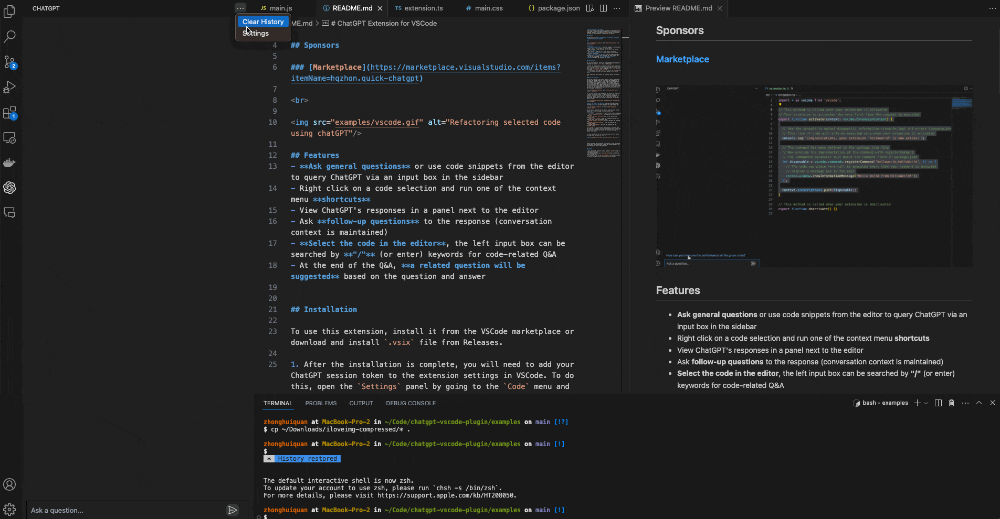
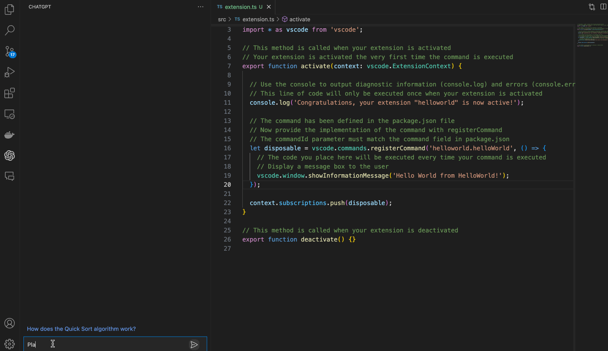
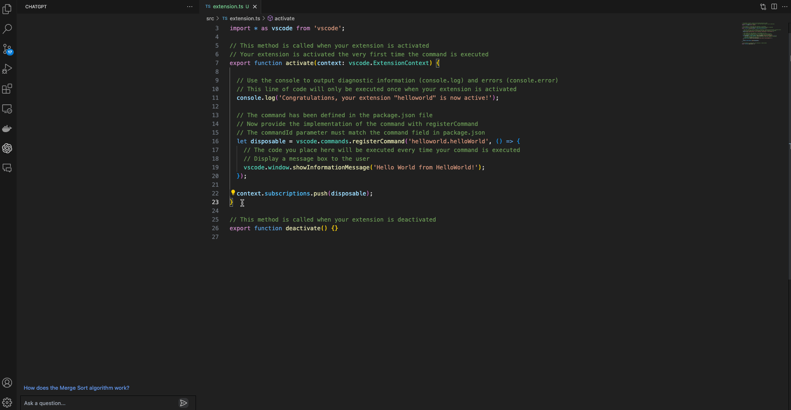
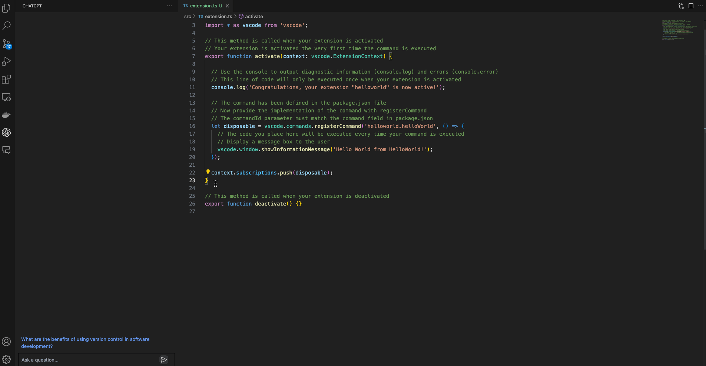
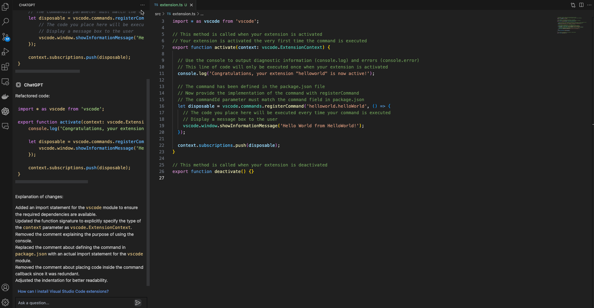

# ChatGPT Extension for VSCode     

English | <a href="README-zh.md">中文</a>

This Visual Studio Code extension allows you to use the [ChatGPT API](https://github.com/hqzhon/chatgpt-api) to generate natural language responses from OpenAI's [ChatGPT](https://chat.openai.com/chat) to your questions, right within the editor.

## Sponsors

### [Marketplace](https://marketplace.visualstudio.com/items?itemName=hqzhon.quick-chatgpt)

 

## Features
- **Ask general questions** or use code snippets from the editor to query ChatGPT via an input box in the sidebar
- Right click on a code selection and run one of the context menu **shortcuts**
- View ChatGPT's responses in a panel next to the editor
- Ask **follow-up questions** to the response (conversation context is maintained)
- **Select the code in the editor**, the left input box can be searched by **"/"** (or enter) keywords for code-related Q&A
- At the end of the Q&A, **a related question will be suggested** based on the question and answer

## Installation

To use this extension, install it from the VSCode marketplace or download and install `.vsix` file from Releases.
After the installation is complete, you need to add the ChatGPT apiKey to VSCode's extension settings. This can be done as follows: 

Or set it up by following these steps:
1. open the `Settings` panel by going to the `Code` menu and selecting `Preferences`, then `Settings`.
2. In the search bar, type `ChatGPT` to filter the settings list.
3. In the ChatGPT section, enter your apiKey in the `apiKey` field.

After completing these steps, the extension should be ready to use. 

## Using the Extension

To use the extension, open a text editor in Visual Studio Code and open the ChatGPT panel by clicking on the ChatGPT icon in the sidebar. This will open a panel with an input field where you can enter your prompt or question. By clicking enter, it will be sent to ChatGPT. Its response will be displayed below the input field in the sidebar (note that it may take some time for it to be calculated).When the generation is over, a relevant question will be suggested and you can ask a question directly by clicking on that question. 

You can also select a code snippet in the editor and then enter a prompt in the side panel, or right-click and select "Ask ChatGPT". The selected code will be automatically appended to your query when it is sent to the AI. This can be useful for generating code snippets or getting explanations for specific pieces of code.

**Select the code in the editor**, the left input box can be searched by **"/"** (or enter) keywords for code-related Q&A.

You can select some code in the editor, right click on it and choose one of the following from the context menu:
#### Commands:
- `Ask ChatGPT`: will provide a prompt for you to enter any query
- `ChatGPT: Explain selection`: will explain what the selected code does
- `ChatGPT: Refactor selection`: will try to refactor the selected code
- `ChatGPT: Find problems`: looks for problems/errors in the selected code, fixes and explains them
- `ChatGPT: Optimize selection`: tries to optimize the selected code
- `ChatGPT: Translate selection`: tries to translate the selected content
- `ChatGPT: Add comments`: tries to add comments for the selected content

`Ask ChatGPT` is also available when nothing is selected. For the other four commands, you can customize the exact prompt that will be sent to the AI by editing the extension settings in VSCode Preferences.

Too much information in the chat screen, you can click on the top right menu to choose to clear it

---

Please note that this extension is currently a proof of concept and may have some limitations or bugs. We welcome feedback and contributions to improve the extension.

## Credits

- This wouldn't be possible without OpenAI's [ChatGPT](https://chat.openai.com/chat)
- The extension makes use of [chatgpt-api](https://github.com/hqzhon/chatgpt-api).
- It is built on top of [mpociot/chatgpt-vscode](https://github.com/mpociot/chatgpt-vscode), which started this project
